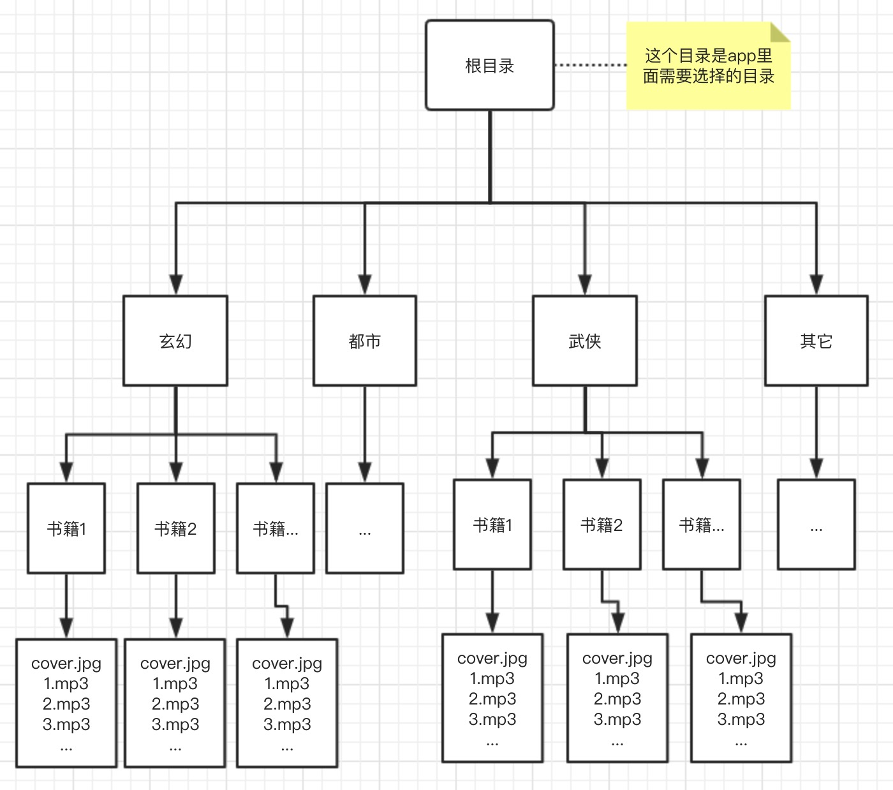
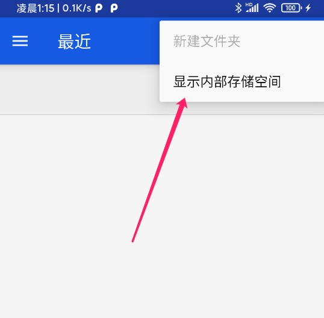
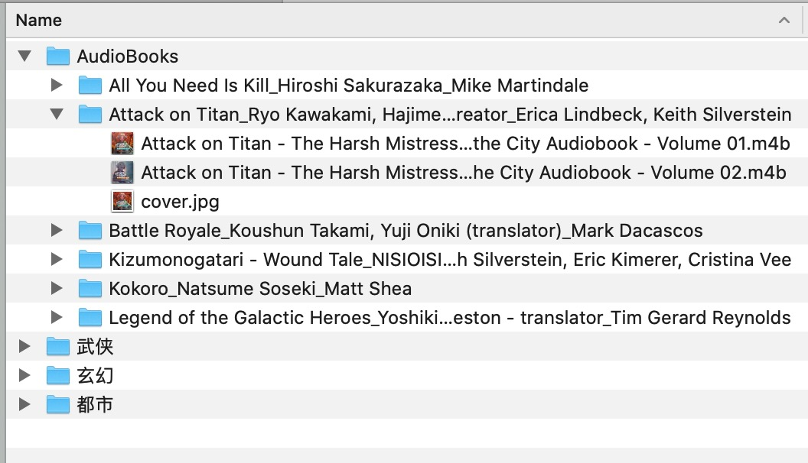
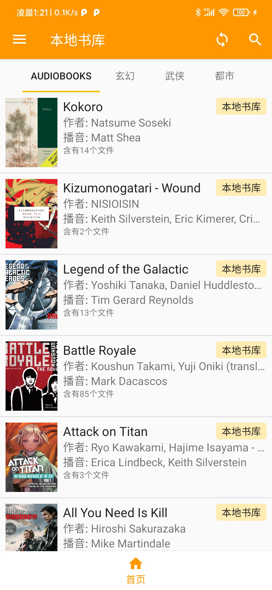

# 本地书库

## 前言

本地书库是播放音频用的，而不是帮你读txt文本的工具。音频资源需要自行去获取。

以下是群友推荐的下载站：[http://www.52wuai.com](http://www.52wuai.com)

群友制作的视频教程: [点击下载](https://eprendre2.coding.net/p/tingshu/d/tingshu/git/raw/master/art/local_book_tutorial.mp4)

## 目录结构

本地书库要求目录分三级，根目录，分类目录，最后才是书籍目录。
如图所示：

## 作者和播音

作者和播音信息在书籍目录名后面加上，格式为: 书籍名_作者_播音

**举例:**
书名：全职高手
作者：蝴蝶蓝
播音：刺儿

目录名则为: 全职高手_蝴蝶蓝_刺儿

## 封面

在书籍目录里扔一个 `cover.jpg` 的图片，后缀名不局限于jpg，png 也可以。

## 章节文件名

章节列表会默认根据文件名里的数字进行排序，所以不用操心去给章节序号补齐 0。但是文件名里不能出现一个以上的数字，例如：`鬼吹灯-第2部-第123章.mp3` 这种是不行的。
以下是正确的例子：`1.mp3`, `03.mp3`, `XXX-04.mp3`

## 选择本地书库目录

点击设置 -> 选择本地书库目录 -> 找到本地书库根目录。

若显示的目录为空，可点击右上角`显示内部存储空间`。

## 实际效果

